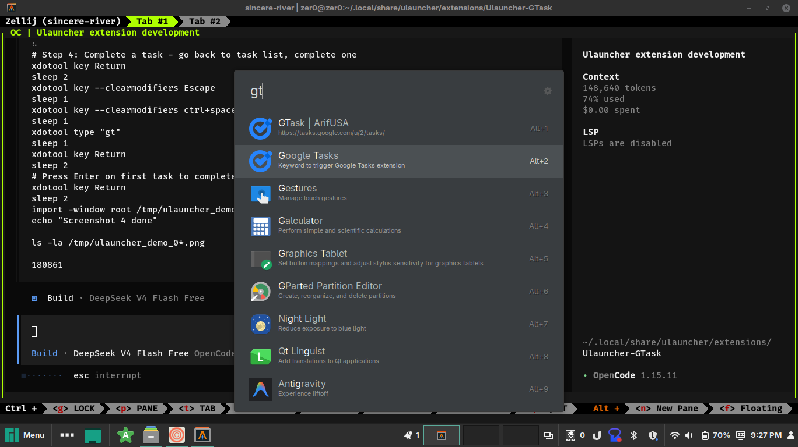
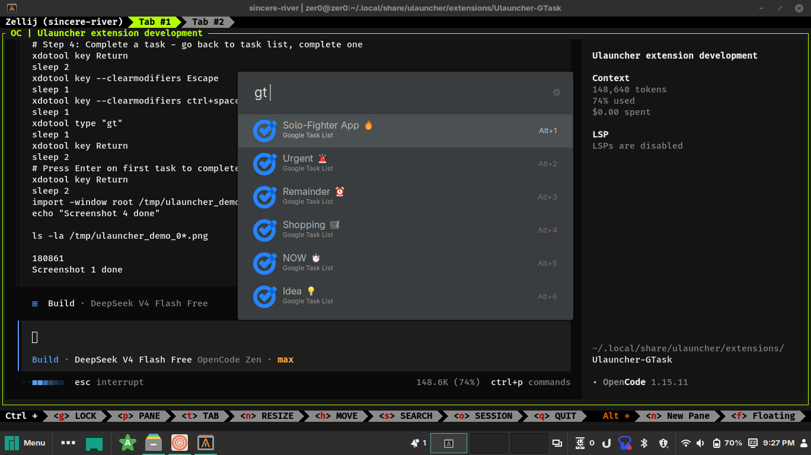
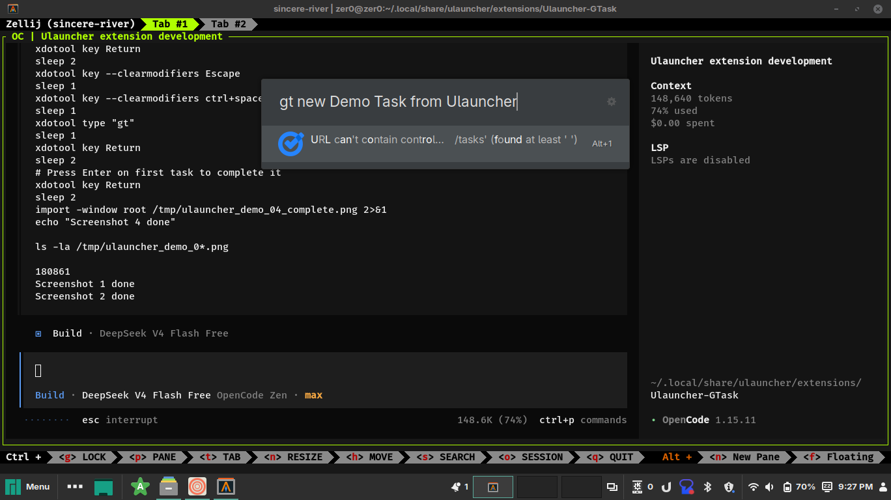
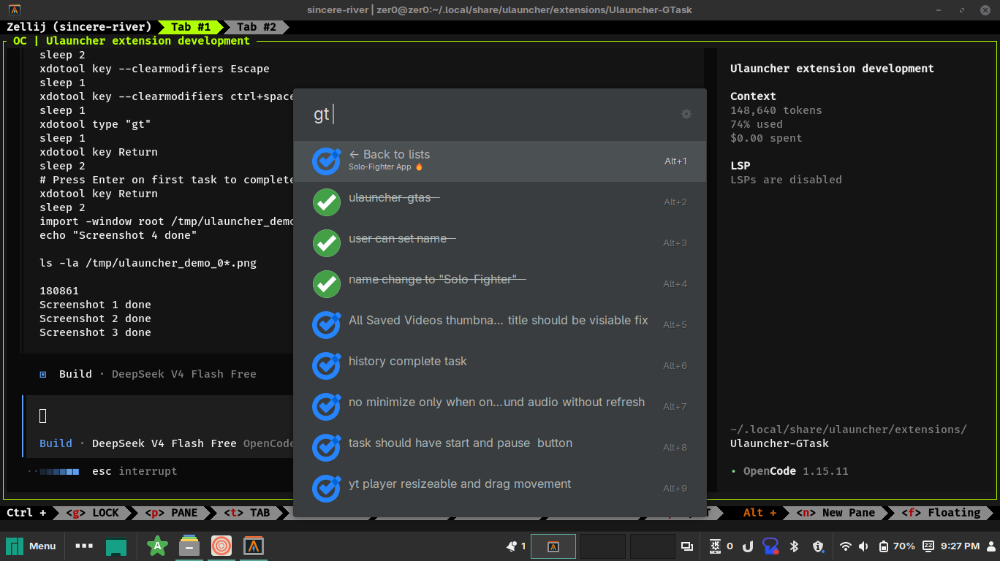

<div align="center">
  
  <h1 align="center">Google Tasks</h1>
  <p align="center">
    A Ulauncher extension for managing your Google Tasks — view, add, complete, search,<br />
    and delete tasks and lists with instant local caching and a satisfying strikethrough effect.
  </p>
  <p align="center">
    <a href="#features">Features</a> •
    <a href="#demo">Demo</a> •
    <a href="#requirements">Requirements</a> •
    <a href="#installation">Installation</a> •
    <a href="#setup">Setup</a> •
    <a href="#usage">Usage</a> •
    <a href="#faq">FAQ</a>
  </p>
  <p align="center">
    
    
    
    
  </p>
</div>

---

## Features

- **Instant local cache** — tasks load from disk cache in under 1ms. No waiting for API on every keystroke
- **Browse task lists** — explore all your Google Task lists and drill into each one
- **Add tasks** — `gt new Buy groceries` → click to confirm
- **Create lists** — `gt newlist Shopping` → click to confirm
- **Complete / uncomplete tasks** — click to toggle between done and undone (strikethrough + green checkmark)
- **Delete tasks** — `gt del <search>` → click to confirm, click again to delete
- **Delete lists** — `gt dellist <search>` → click to confirm, click again to delete (all tasks in the list are lost)
- **Search & filter** — type any part of a list or task name to instantly filter
- **Customizable** — keyword, default list, completed-task visibility, and result limit are all configurable from Ulauncher Preferences
- **Zero dependencies** — built entirely on Python's standard library. No `pip install` required.

## Demo

| Step | Screenshot |
|---|---|---|
| Task lists |  |
| Tasks in a list |  |
| Adding a task |  |
| Completing a task (strikethrough) |  |

## Requirements

- [Ulauncher](https://ulauncher.io) 5.15+ (Extension API v2)
- Python 3.6+
- A Google account with [Google Tasks](https://tasks.google.com) enabled

## Installation

```bash
# Clone the repository into the Ulauncher extensions directory
git clone https://github.com/arif-itm/ulauncher-gtask.git \
  ~/.local/share/ulauncher/extensions/Ulauncher-GTask
```

Then enable the extension in **Ulauncher Preferences → Extensions**.

## Setup

This extension uses the official Google Tasks API, which requires OAuth 2.0 credentials from your Google Cloud project.

### 1. Enable the Google Tasks API

1. Go to the [Google Cloud Console](https://console.cloud.google.com)
2. Create a new project (or select an existing one)
3. Navigate to **APIs & Services → Library**
4. Search for **Google Tasks API** and click **Enable**

### 2. Configure the OAuth consent screen

1. Go to **APIs & Services → OAuth consent screen**
2. Select **External** as the user type
3. Fill in the required fields (app name, support email, developer contact)
4. Under **Test users**, add the email address associated with your Google Tasks
5. Click **Save**

### 3. Create OAuth credentials

1. Go to **APIs & Services → Credentials**
2. Click **Create Credentials → OAuth client ID**
3. Application type: **Desktop app**
4. Give it a name (e.g., "Ulauncher Google Tasks")
5. Click **Create**
6. Download the JSON file

### 4. Place the credentials file

```bash
cp ~/Downloads/client_secret_*.json \
  ~/.local/share/ulauncher/extensions/Ulauncher-GTask/credentials.json
```

## Usage

### First run

```bash
# Restart Ulauncher in dev mode (optional, for detailed logs)
ulauncher --no-extensions --dev -v
```

1. Type your keyword (default: `gt`) and press <kbd>Space</kbd>
2. Click **Sign in with Google** — your browser will open for authorization
3. Grant access, then return to Ulauncher
4. Your task lists are now visible

### Commands

| Keyword | Context | Action |
|---|---|---|
| `gt` | lists level | Browse all task lists |
| `gt <search>` | lists level | Filter task lists by name |
| (click list) | lists level | Open list and show its tasks |
| `gt` | inside list | Browse all tasks |
| `gt <search>` | inside list | Filter tasks by title |
| `gt new <title>` | any | Show confirm → add to current list (or default/first) |
| `gt newlist <name>` | lists level | Show confirm → create new task list |
| `gt del <search>` | inside list | Show tasks → click to confirm → click again to delete |
| `gt dellist <search>` | lists level | Show lists → click to confirm → click again to delete |
| `gt back` | any | Go back to lists level |
| (click uncompleted task) | inside list | Mark task as completed (strikethrough + green icon) |
| (click completed task) | inside list | Un-complete task (restore to active) |

### Key bindings

| Key | Action |
|---|---|
| <kbd>Enter</kbd> | Execute action / open list / authenticate / confirm delete |
| <kbd>Esc</kbd> | Close Ulauncher |

## Customization

Open **Ulauncher Preferences → Extensions → Google Tasks**:

| Preference | Description | Default |
|---|---|---|
| Keyword | Trigger word for the extension | `gt` |
| Default Task List | List used when adding tasks without selecting one first | *(first list)* |
| Show Completed Tasks | Whether completed tasks appear in lists | `Hide` |
| Result Limit | Maximum tasks to show per list (leave empty for no limit) | *(unlimited)* |

## Architecture

```
┌─────────────────────────────────────────────────────────────┐
│                     Ulauncher (WebSocket)                    │
└─────────────────────────┬───────────────────────────────────┘
                          │ IPC
┌─────────────────────────▼───────────────────────────────────┐
│  main.py                                                     │
│  ┌──────────────────────────────────────────────────────┐   │
│  │ Extension (event loop)                               │   │
│  │  ├─ KeywordQueryEventListener                        │   │
│  │  └─ ItemEnterEventListener                           │   │
│  └──────────────────────────────────────────────────────┘   │
└─────────────────────────┬───────────────────────────────────┘
                          │ method calls
┌─────────────────────────▼───────────────────────────────────┐
│  gtask_client.py                                             │
│  ┌──────────────────────────────────────────────────────┐   │
│  │ GoogleTasksAuth (OAuth 2.0)                          │   │
│  │  ├─ run_local_server() → browser auth                │   │
│  │  ├─ token persistence (token.json)                   │   │
│  │  └─ auto-refresh on expiry                           │   │
│  └──────────────────────────────────────────────────────┘   │
│  ┌──────────────────────────────────────────────────────┐   │
│  │ GoogleTasksClient (REST + local cache)                 │   │
│  │  ├─ cache.json (disk persistence)                    │   │
│  │  ├─ list_tasklists()                                 │   │
│  │  ├─ list_tasks()                                     │   │
│  │  ├─ insert_task()                                    │   │
│  │  ├─ complete_task() / uncomplete_task()              │   │
│  │  ├─ delete_task() / delete_tasklist()                │   │
│  │  ├─ create_tasklist()                                │   │
│  │  └─ sync_all()                                       │   │
│  └──────────────────────────────────────────────────────┘   │
└─────────────────────────┬───────────────────────────────────┘
                          │ HTTPS (raw urllib)
┌─────────────────────────▼───────────────────────────────────┐
│          Google Tasks API (tasks.googleapis.com)             │
└─────────────────────────────────────────────────────────────┘
```

## Local caching

All data is stored in `cache.json` in the extension directory. On first launch, the extension fetches all lists and tasks from Google and saves them locally.

- **Reads** (listing, searching, filtering) are served from disk cache — **under 1ms**
- **Writes** (add, complete, uncomplete, delete) call the API first, then update the cache
- The cache is never automatically re-synced from Google after initial fetch — only updated when you make changes
- Delete `cache.json` manually to force a re-fetch on next launch

## Strikethrough effect

When you complete a task, the extension:

1. Calls the Google Tasks API to mark it as `completed`
2. Renders the task title with the Unicode combining long stroke overlay (`\u0336`) applied to each character — producing `c̶o̶m̶p̶l̶e̶t̶e̶d̶`
3. Swaps the icon to `images/checked.svg` (green checkmark)
4. Click again to **uncomplete** — the task returns to active state

Completed tasks are hidden by default unless you toggle **Show Completed Tasks** in Preferences.

## File structure

```
~/.local/share/ulauncher/extensions/Ulauncher-GTask/
├── images/
│   ├── icon.svg               # Google Tasks logo
│   └── checked.svg            # Green checkmark (completed state)
├── versions.json              # Extension API version mapping
├── manifest.json              # Extension metadata & user preferences
├── main.py                    # Ulauncher extension entry point
├── gtask_client.py            # OAuth 2.0 + Google Tasks REST client + local cache
├── credentials.json           # Your Google Cloud OAuth credentials (user-provided)
├── token.json                 # Auto-generated OAuth session (do not commit)
├── cache.json                 # Auto-generated local cache of all lists and tasks
├── .gitignore
├── LICENSE
└── README.md
```

## FAQ

<details>
<summary><strong>Why does the extension need OAuth credentials?</strong></summary>
Google Tasks is a personal API that requires authentication. The extension uses OAuth 2.0 with a local server to authorize your account. Your credentials and tokens stay on your machine.
</details>

<details>
<summary><strong>Can I use this with multiple Google accounts?</strong></summary>
Currently, the extension supports one account at a time. To switch, delete <code>token.json</code> from the extension directory and re-authenticate.
</details>

<details>
<summary><strong>Are my tasks stored locally?</strong></summary>
Yes and no. A local cache (<code>cache.json</code>) stores the last known state of all lists and tasks so that browsing and searching are instant. Writes (add, complete, uncomplete, delete) go directly to Google's API and then update the cache. You can delete <code>cache.json</code> at any time — it will be re-fetched from Google on the next launch.
</details>

<details>
<summary><strong>What happens if my token expires?</strong></summary>
The extension automatically refreshes the token using the refresh token provided by Google during initial authorization. If the refresh token also expires (e.g., account password change), you'll be prompted to re-authenticate.
</details>

## License

[MIT](LICENSE) © 2026 arif-itm
